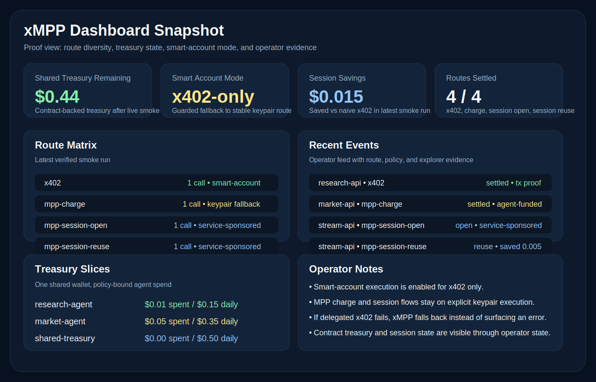
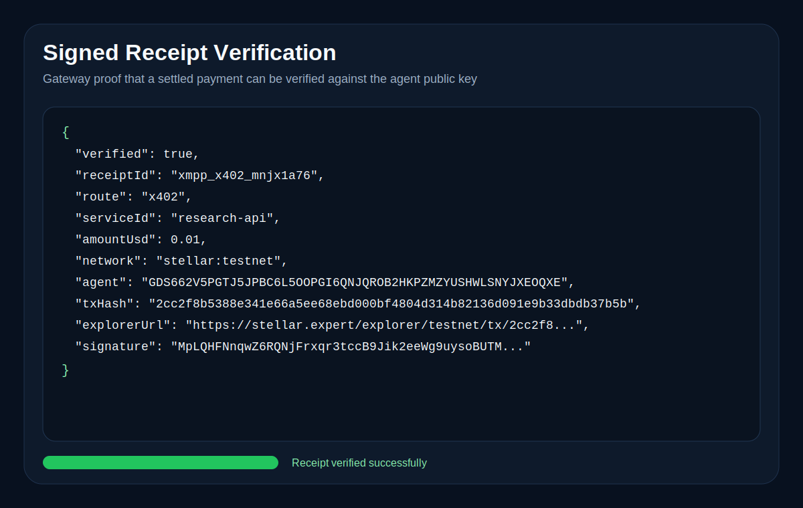
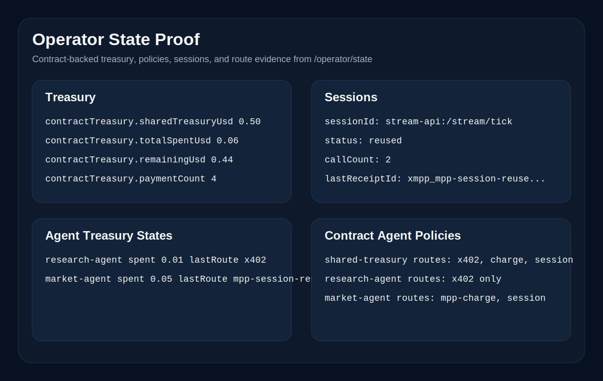
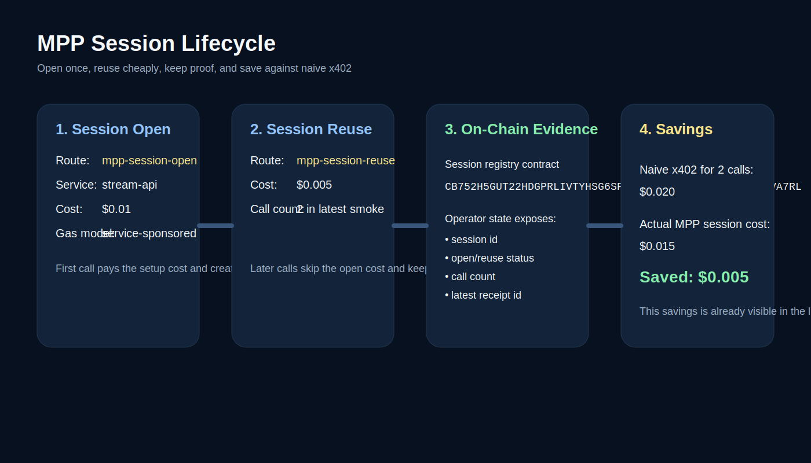
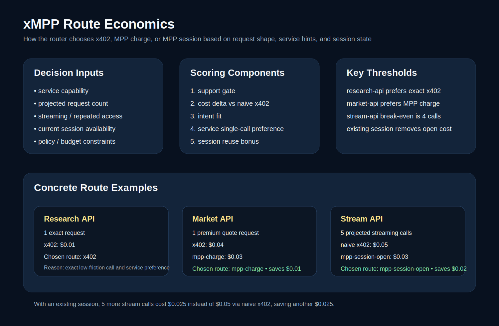
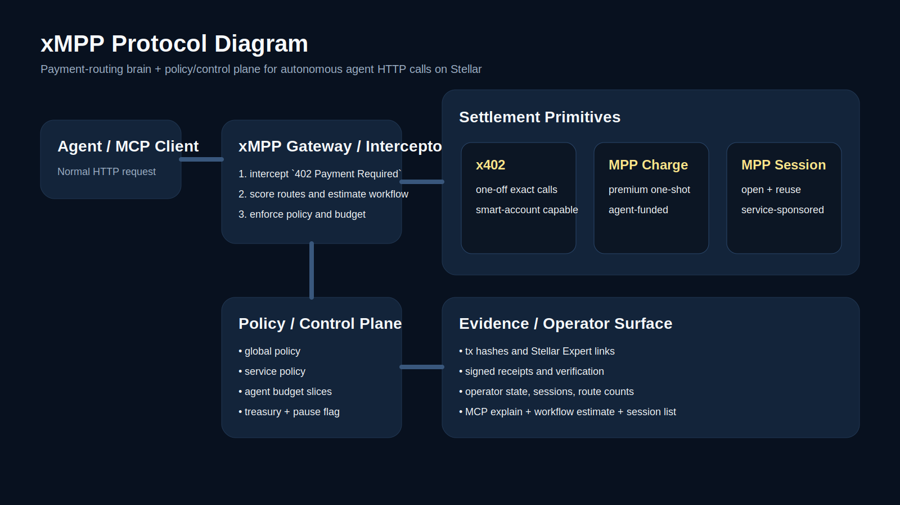

# xMPP

<p>
  
</p>

xMPP is the payment-routing brain and policy/control plane for autonomous agents on Stellar.

xMPP gives an agent one payment-aware fetch path that can:

- call a paid tool normally
- intercept `402 Payment Required`
- evaluate route economics, treasury policy, and budget limits
- settle through `x402`, `MPP charge`, or `MPP session`
- retry automatically
- expose operator-facing route, budget, receipt, and session metadata

The core idea is simple:

- `x402` for exact one-off requests
- `mpp-charge` for premium one-shot calls
- `mpp-session-open` and `mpp-session-reuse` for repeated or streaming usage

xMPP sits between an agent and paid tools as a routing and control layer. It helps autonomous systems choose the right settlement primitive while keeping budgets, policies, and receipts visible to operators.

Important naming note:

- `xMPP` means `x402 + MPP` routing on Stellar, not the older XMPP messaging protocol
- `MPP charge` and `MPP session` in this repo refer to Stellar-native payment flows aligned with modern machine-payment patterns, settled on Stellar

## Live Proof

Real Stellar testnet proof from the current demo stack:

- x402 smart-account settlement:
  - https://stellar.expert/explorer/testnet/tx/2cc2f8b5388e341e66a5ee68ebd000bf4804d314b82136d091e9b33dbdb37b5b
- mpp-charge settlement:
  - https://stellar.expert/explorer/testnet/tx/3125c05d57563e027717cc52eff478c6612cb55fcd57a2eaee21cd5f3241b34e
- additional x402 preflight settlement:
  - https://stellar.expert/explorer/testnet/tx/16c3093215a363b79ed8a5678d9549236b8b7a74f2b818caa3c46d4c5155f1e5

Product proof visuals:







## MPP Session Economics

xMPP makes MPP session behavior visible instead of hiding it behind “it’s cheaper somehow.”

The latest verified smoke run showed:

- first stream call used `mpp-session-open`
- second stream call used `mpp-session-reuse`
- session state was visible in `/operator/state`
- session savings were visible as `$0.015`

For the current 2-call verified session path:

- naive x402 cost: `$0.020`
- actual MPP session cost: `$0.015`
- savings: `$0.005`



## Route Economics

xMPP compares request shape, service hints, reusable session state, and policy constraints before it settles a paid call.

- research-api, 1 exact request:
  - `x402 = $0.01`
  - chosen route: `x402`
- market-api, 1 premium quote:
  - naive `x402 = $0.04`
  - `mpp-charge = $0.03`
  - chosen route: `mpp-charge`
- stream-api, 5 projected streaming calls:
  - naive `x402 = $0.05`
  - `mpp-session-open = $0.03`
  - chosen route: `mpp-session-open`
- stream-api, 5 more calls on a reusable session:
  - naive `x402 = $0.05`
  - `mpp-session-reuse = $0.025`
  - chosen route: `mpp-session-reuse`



See [route-economics.md](./docs/route-economics.md) and [router-algorithm.md](./docs/router-algorithm.md) for the scoring model behind these decisions.

## Protocol Diagram

Overview of the protocol flow:



## What Exists Now

- gateway API for paid fetches, route previews, operator state, and wallet status
- MCP server with fetch, wallet, preview, explain, session, and workflow-estimation tools
- demo services for x402, MPP charge, and MPP session flows
- operator dashboard with live route counts, budget state, session telemetry, and event feed
- shared treasury agents with separate research and market worker ceilings on one wallet
- release-packed `@xmpp/core` SDK and `@xmpp/mcp` server package surfaces
- Soroban contracts for global policy, service policy, pause control, and session registry
- runtime contract wiring with local fallback when contract ids are absent
- live smoke script covering x402, MPP charge, MPP session open, MPP session reuse, and deny-by-policy

## Architecture

- `apps/gateway`
  - JSON API for fetch, policy preview, wallet state, catalog, and operator state
- `apps/demo-services`
  - paid local services used in the demo, including `/.well-known/xmpp.json` capability documents
- `apps/mcp-server`
  - stdio MCP server package surface for MCP-compatible clients
- `apps/dashboard`
  - operator console for the demo
- `packages/router`
  - catalog-driven route scoring and workflow estimation
- `packages/http-interceptor`
  - 402 interception, retry, budget snapshots, and operator event tracking
  - shared-treasury agent controls and per-agent budget accounting
- `packages/payment-adapters`
  - x402 and MPP payment execution adapters
- `packages/core`
  - publishable SDK with gateway client, route planning, and a bootstrap CLI
- `packages/policy-engine`
  - local and contract-backed policy decisions
- `contracts`
  - `xmpp-policy` and `xmpp-session-registry`

## Quick Start

```bash
pnpm install
cp .env.example .env
pnpm xmpp:bootstrap -- --dry-run
pnpm xmpp:bootstrap -- --friendbot
pnpm check
```

Start each process in its own terminal:

```bash
pnpm xmpp:facilitator
pnpm xmpp:services
pnpm xmpp:gateway
pnpm xmpp:dashboard
pnpm xmpp:mcp
```

Default ports:

- facilitator: `http://localhost:4022`
- gateway: `http://localhost:4300`
- dashboard: `http://localhost:4310`
- research API: `http://localhost:4101`
- market API: `http://localhost:4102`
- stream API: `http://localhost:4103`

## Required Environment

Core live settlement values:

- `XMPP_AGENT_SECRET_KEY`
- `FACILITATOR_STELLAR_PRIVATE_KEY`
- `MPP_SECRET_KEY`

Optional but important for the full demo:

- `X402_RECIPIENT_ADDRESS`
- `MPP_RECIPIENT_ADDRESS`
- `MPP_CHANNEL_CONTRACT_ID`
- `XMPP_POLICY_CONTRACT_ID`
- `XMPP_SESSION_REGISTRY_CONTRACT_ID`
- `XMPP_DASHBOARD_GATEWAY_URL`

`XMPP_DASHBOARD_GATEWAY_URL` is optional for local runs. Set it when the dashboard needs to point at a non-local gateway deployment.

Generate free Stellar testnet identities:

```bash
stellar keys generate agent
stellar keys generate facilitator
stellar keys generate mpp-server

stellar keys secret agent
stellar keys secret facilitator
stellar keys secret mpp-server
```

Fund them with Friendbot:

```bash
curl "https://friendbot.stellar.org/?addr=$(stellar keys address agent)"
curl "https://friendbot.stellar.org/?addr=$(stellar keys address facilitator)"
curl "https://friendbot.stellar.org/?addr=$(stellar keys address mpp-server)"
```

## Verification

Workspace checks:

```bash
pnpm check
cd contracts && cargo test
pnpm release:pack
```

Live smoke path:

```bash
pnpm xmpp:smoke
pnpm xmpp:demo:smoke
pnpm xmpp:preflight
```

The smoke script exercises:

- `x402`
- `mpp-charge`
- `mpp-session-open`
- `mpp-session-reuse`

## Installable Packages

The public package family is release-packed locally through:

```bash
pnpm release:pack:public
```

That creates `.release-public/manifest.json` plus tarballs for the published scoped package family.
- policy deny flow

## Gateway API

- `GET /health`
- `GET /wallet`
- `GET /catalog`
- `GET /operator/state`
- `GET /policy/preview?url=...`
- `POST /receipts/verify`
- `POST /fetch`

Example paid fetch:

```bash
curl -s http://localhost:4300/fetch \
  -H 'content-type: application/json' \
  -d '{
    "url":"http://localhost:4101/research?q=stellar",
    "method":"GET",
    "options":{"agentId":"research-agent","serviceId":"research-api","projectedRequests":1}
  }' | jq
```

## MCP Tools

- `xmpp_fetch`
- `xmpp_agent_profiles`
- `xmpp_wallet_info`
- `xmpp_policy_preview`
- `xmpp_explain`
- `xmpp_session_list`
- `xmpp_estimate_workflow`
- `xmpp_receipt_verify`

## Agent Flow

xMPP already exposes the surfaces needed for an agent to preview, pay, explain, and verify the same workflow.

- MCP path:
  - `xmpp_policy_preview` -> `xmpp_fetch` -> `xmpp_explain` -> `xmpp_session_list` -> `xmpp_receipt_verify`
- gateway-backed path:
  - [langchain-agent.py](./examples/langchain-agent.py)

See [agent-flow.md](./docs/agent-flow.md) for the canonical sequence.

## Installable Packages

The workspace package names stay under `@xmpp/*` inside the repo.

The public npm story is intentionally small:

- `@vinaystwt/xmpp-core`
- `@vinaystwt/xmpp-mcp`

Those are the only packages meant to be treated as public entrypoints.

Build the local workspace package surfaces:

```bash
pnpm --filter @xmpp/core build
pnpm --filter @xmpp/mcp build
```

Build the scoped public release tarballs:

```bash
pnpm release:pack:public
```

Intended package entrypoints:

- `@vinaystwt/xmpp-core`
  - gateway client, router helpers, and type exports
- `@vinaystwt/xmpp-core/local`
  - in-process `xmppFetch` and operator-state helpers
- `@vinaystwt/xmpp-mcp`
  - MCP server factory for stdio agent integrations
- `xmpp-demo bootstrap`
  - SDK CLI for generating and funding testnet identities into a local `.env.local`

Example signed receipt verification:

```bash
curl -s http://localhost:4300/receipts/verify \
  -H 'content-type: application/json' \
  -d '{
    "receipt":{
      "receiptId":"xmpp_x402_demo",
      "issuedAt":"2026-04-03T00:00:00.000Z",
      "network":"stellar:testnet",
      "agent":"G...",
      "serviceId":"research-api",
      "url":"http://localhost:4101/research?q=stellar",
      "method":"GET",
      "route":"x402",
      "amountUsd":0.01,
      "signature":"..."
    }
  }' | jq
```

## Contracts

Build and test:

```bash
cd contracts
cargo test
```

Deploy to Stellar testnet:

```bash
./contracts/scripts/deploy-testnet.sh <stellar-identity-or-secret>
```

The deploy script writes ids to `contracts/scripts/addresses.json`.

## Smart Account Coverage

- `x402` is the only route currently exercised through the guarded smart-account path
- `mpp-charge` and `mpp-session` remain keypair-backed in the current verified demo configuration
- the guarded fallback is intentional: it preserves live settlement reliability while the smart-account path is narrowed to the route that is already verified end to end

That means xMPP already shows smart-account-aware settlement, but it does not yet claim smart-account-first execution for every route.

## Docs

- [architecture.md](./docs/architecture.md)
- [api-catalog.md](./docs/api-catalog.md)
- [router-algorithm.md](./docs/router-algorithm.md)
- [route-economics.md](./docs/route-economics.md)
- [agent-flow.md](./docs/agent-flow.md)
- [deployment.md](./docs/deployment.md)
- [demo-script.md](./docs/demo-script.md)
- [release-checklist.md](./docs/release-checklist.md)
- [threat-model.md](./docs/threat-model.md)
- [PROTOCOL.md](./docs/PROTOCOL.md)
- [sdk.md](./docs/sdk.md)
- [python-client.py](./examples/python-client.py)
- [node-sdk.ts](./examples/node-sdk.ts)
- [langchain-agent.py](./examples/langchain-agent.py)

## Current Gaps

- smart-account execution is still partial and not yet the default settlement path
- service discovery is exposed for the demo through `/.well-known/xmpp.json`, but the router is still local-catalog first
- fee sponsorship is route-specific: the verified demo configuration keeps `mpp-charge` agent-funded and enables service-sponsored gas for `mpp-session`
- deeper contract-backed multi-agent treasury controls are live, but smart-account-first settlement is still stretch work
